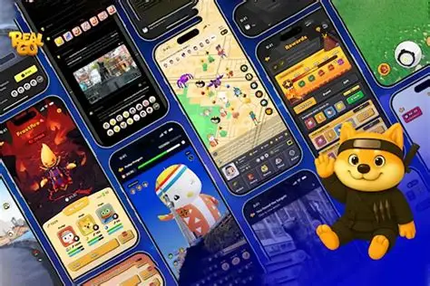
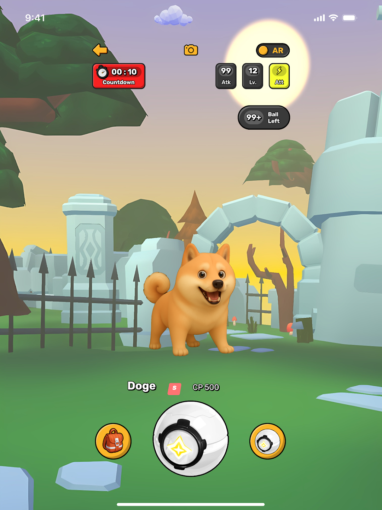

# RealGo 🎮🌍✨

> The world's first immersive **AR + AI + Web3** game built on location-based gameplay, where global meme IPs are transformed into living, interactive experiences.

---

## 🚀 Overview
**RealGo** bridges **Web2 familiarity** with **Web3 innovation**, turning your everyday surroundings into a gamified, social adventure full of memes, rewards, and real-world interaction.

- 🌐 Location-based gameplay  
- 🤖 AI-driven immersive experiences  
- 🪙 Web3 integration with global meme IPs  
- 🎁 Rewards & real-world interaction  

---

## 🛠️ Tech Stack
- **Blockchain**: Built on **BNB Smart Chain (BSC)**  
- **Compatibility**: Supports other **EVM networks**  
- **Core Features**: AR, AI, Web3, Meme IP gamification  

---

## 📸 Highlights
- Transform memes into **living, interactive experiences**  
- Explore your city with **AR quests & rewards**  
- Social gameplay with **friends & community**  
- Seamless bridge between **Web2 familiarity** and **Web3 innovation**  

---

## 📊 Status
This repository is currently **private**.  
RealGo is **not open sourced** at the moment.  

---

## 📷 Screenshots & Demo
> *Visual previews of gameplay and features (to be added when public assets are available)*

  🎮 Gameplay Interface  
  

  🤝 Meme IP Interactive Demo  
  
  
  Web3 Rewards Interface  
  
  
  🗺️ AR Map Adventure  
  

> *All screenshots are previews from RealGo’s beta version. Final visuals may differ.* 
---

## 🗺️ Roadmap
- ✅ Core AR gameplay with meme IPs  
- ✅ Web3 wallet integration (BNB Smart Chain)  
- 🔜 NFT collectibles & trading  
- 🔜 Cross-chain support for other EVM networks  
- 🔜 Expanded meme IP partnerships  
- 🔜 Community-driven quests & events  

---

## 🌐 Community
Join the RealGo community to stay updated:  
- Twitter: [@RealGoGame](https://x.com/RealGoOfficial)  
- Discord: [RealGo Community](https://discord.com/invite/fg7PZtAfC9)  
- Telegram: [RealGo Official](https://t.me/RealGoOfficial)  
- Medium: [RealGo Official](https://medium.com/@RealGoOfficial)  
- Instagram: [RealGo Official](https://www.instagram.com/RealGoOfficial)  
- Tiktok: [RealGo Official](https://www.tiktok.com/@RealGoOfficial)   
- Youtube: [RealGo Official](https://youtube.com/@RealGoOfficial)  

---

## 📬 Contact
For inquiries, collaborations, or partnerships:  
📧 **gm@realgo.game**

---

## 🏷️ Badges

---

## 🌟 Vision
RealGo is designed to **redefine gaming** by merging the digital and physical worlds, creating a **social adventure** where memes, rewards, and real-world interaction converge.