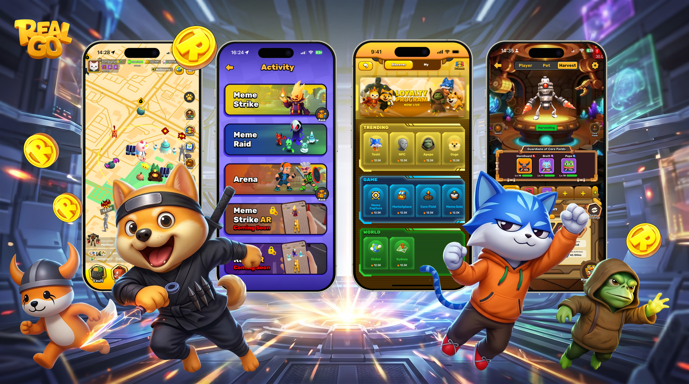
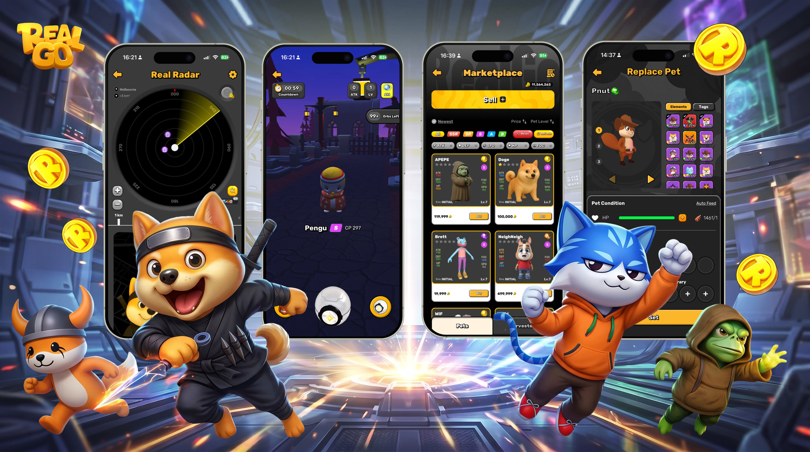
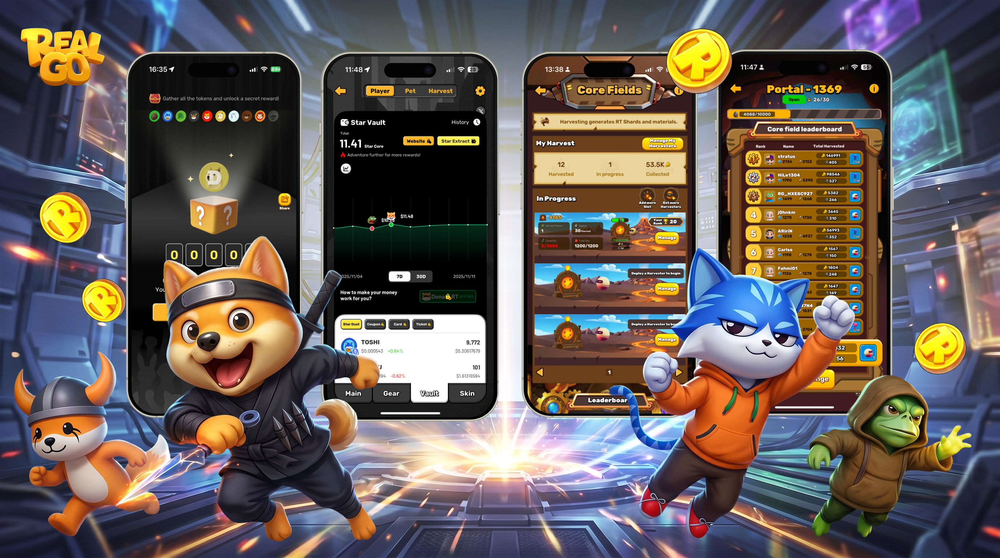
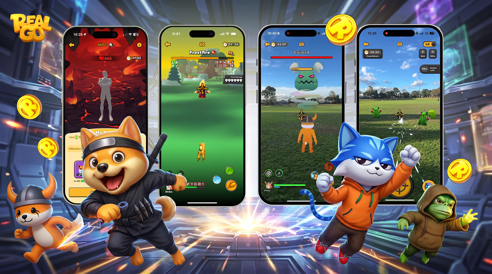

# RealGo 🎮🌍✨

> The world's premier **Meme Infrastructure and Asset Application Layer**. Leveraging **AR + AI + LBS** technology, we transform global Meme IPs into playable, liquid, and utility-driven interactive experiences.

## 🚀 Overview
**RealGo** is the definitive **"Meme 3.0"** execution layer. By bridging mass-market mobile gaming with Web3 innovation, we transcend traditional GameFi to give Meme assets tangible, real-world utility. We turn your everyday surroundings into a gamified, social adventure—providing global Meme communities with sustainable economics, multi-IP cultural integration, and diverse application scenarios.

## 🛠️ Tech Stack
### 🔗 Blockchain & Web3
- **Blockchain**: Built on **BNB Smart Chain (BSC)**  
- **Compatibility**: Supports other **EVM networks**  
- **Smart Contracts**: Solidity  
- **Libraries**: ethers.js, web3.js  

### 🎮 Game Development
- **Engine**: Unity  
- **Languages**: C#, .NET  
- **Features**: AR, AI, Meme IP gamification  

### 🌐 Frontend
- **Frameworks**: React.js, Vue.js, Angular  
- **Core Features**: Immersive UI, interactive gameplay  

### ⚙️ Backend & Services
- **Languages**: Node.js, Python, Rust  
- **Architecture**: API services, real-time data handling  
- **Cloud Services**: Scalable deployment & storage  

### 📊 Core Features
- 🌐 Location-based gameplay  
- 🤖 AI-driven immersive experiences  
- ⛓️ Web3 integration with global meme IPs  
- 🎁 Rewards & real-world interaction  

## 📸 Highlights
- Transform memes into **living, interactive experiences**  
- Explore your city with **AR quests & rewards**  
- Social gameplay with **friends & community**  
- Seamless bridge between **Web2 familiarity** and **Web3 innovation**  

## 📊 Status
This repository is currently **private**.  
RealGo is **not open sourced** at the moment.  

## 📷 Screenshots & Demo

  🎮 Gameplay Interface  
  

  🤝 Meme IP Interactive  
  
  
  💠 Web3 Rewards Interface  
  
  
  🗺️ AR Map Adventure  
  

> *All screenshots are previews from RealGo’s beta version. Final visuals may differ.* 

## 🗺️ Roadmap
**Phase 1: Foundation & Market Validation (Live)**
- [x] Launch of Immersive AR+AI+LBS Mobile Game & Web3 DApp
- [x] Achieve mass-market traction (270,000+ Registered Players & 31,000+ On-Chain Wallets)
- [x] BNB Smart Chain Integration & Genesis Protocol Revenue Generation
- [x] Deep Product Integration with Top-Tier Meme IPs (FLOKI, Toshi, APEPE, NPC, DOGELON)

**Phase 2: TGE & Token Utility (Q2 2026)**
- [ ] `$RT` Token Generation Event (TGE) & Tier-1 CEX / DEX Listings
- [ ] Rollout of Tokenomics 2.0 (On-Chain Utility & Pre-TGE Loyalty Points Conversion)
- [ ] Launch of Meme-themed Social Chats & Interactive Info Dashboards

**Phase 3: Advanced Gameplay & Expansion (Q3 2026)**
- [ ] Deployment of Harvester Rental Marketplace 
- [ ] Major PvP System Upgrades & Competitive Esports Tournaments
- [ ] Ecosystem Expansion via Telegram (TON) Mini-Game Deployment

**Phase 4: Developer Infrastructure (Q4 2026 & Beyond)**
- [ ] Launch of Meme MCP (Multi-chain Consumer Protocol)
- [ ] AI-Agent Tooling for new and emerging Meme projects
- [ ] Cross-chain support for other major EVM networks

## 🌐 Community
Join the RealGo community to stay updated:  
- Twitter: [@RealGoGame](https://x.com/RealGoOfficial)  
- Discord: [RealGo Community](https://discord.com/invite/fg7PZtAfC9)  
- Telegram: [RealGo Official](https://t.me/RealGoOfficial)  
- Facebook: [RealGo Official](https://facebook.com/@RealGoOfficial)  
- Instagram: [RealGo Official](https://www.instagram.com/RealGoOfficial)  
- Tiktok: [RealGo Official](https://www.tiktok.com/@RealGoOfficial)   
- Youtube: [RealGo Official](https://youtube.com/@RealGoOfficial)  

## 📬 Contact
For inquiries, collaborations, or partnerships:  
📧 **gm@realgo.game**

## 🏷️ Badges

## 🌟 Vision
RealGo is designed to **redefine gaming** by merging the digital and physical worlds, creating a **social adventure** where memes, rewards, and real-world interaction converge.
